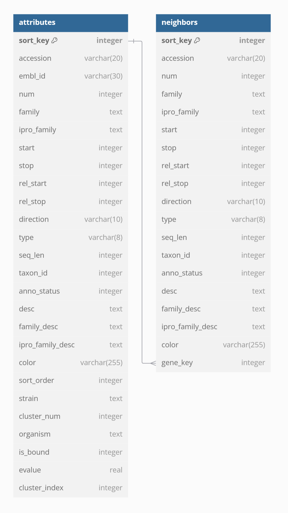

Genome Neighborhood Diagram Tool
================================

The genome neighborhood diagram tool creates databases for genome
neighborhood diagrams (GNDs).  The output database is in SQLite format
and is designed to be used in a web-based viewer app; while the database
is presented graphically, the tables in the database can be analyzed using
custom bioinformatics tools and scripts should the user so desire.

The pipeline uses an input file containing a list of IDs, and optionally
cluster numbers, and generates the GND database by retrieving the
genome context for the IDs.  If clusters are specified, then the IDs in
the database are retrieved in such a way that they can be displayed in
the web viewer grouped by cluster number.

Running the Pipeline
--------------------

Generating a Parameter File
~~~~~~~~~~~~~~~~~~~~~~~~~~~

The GND pipeline loads sequence IDs from the input file (e.g. ``id_list.txt``)
and extracts genome context from the EFI database to create the GNDs.
The parameter file that configures the GND pipeline can be created using the
``bin/create_gnd_nextflow_params.py`` script.  An example usage of the command: ::

    python bin/create_gnd_nextflow_params.py --cluster-id-map id_list.txt --output-dir results/ --efi-config efi.config --efi-db efi_db.sqlite --nextflow-config file.config

A file ``params.yml`` is generated in ``results/`` that contains the
information needed to run the GND pipeline.  Additionally, a shell script
``run_nextflow.sh`` is output to the same directory.  See
:doc:`../../reference/params_yml` for more information on the file format.  The
pipeline may then be executed using the shell script: ::

    bash results/run_nextflow.sh

GND pipeline-specific arguments are:

* ``--cluster-id-map``: path to a file that contains a mapping of cluster
  number to sequence IDs; these IDs are used to query the input ``--efi-db``
  to find genome context. [*required*]

See :doc:`../../reference/common_args` for information on the other, required
arguments.

Generating a Job Script
~~~~~~~~~~~~~~~~~~~~~~~

The pipelines were designed to run on a cluster because of the large dataset
and computational intensity.  An additional script is provided which can
generate a job script for SLURM as well as the parameter file.  To generate
these files, ::

    python bin/create_nextflow_job.py gnd --cluster-id-map id_list.txt --output-dir results/ --efi-config efi.config --efi-db efi_db.sqlite --nextflow-config slurm.config

In addition to the ``params.yml`` seen above, this will generate a SLURM job
submission script called ``run_nextflow.sh`` which can be started by running
``sbatch run_nextflow.sh``.

Database Schema
---------------

The database is composed of two primary tables containing information for
displaying the diagrams: the C<attributes> table with one row for every ID
in the input file, and the C<neighbors> table for the neighbors of each
ID.  The C<neighbors> table is linked to the C<attributes> table through
the C<gene_key> field which maps to the C<attributes>.C<sort_key> field.

See the Schema section in the
:doc:`GND module documentation </source/lib/EFI/GNT/GND.pm>`
for an explanation of the schema fields.

Further Reading
---------------

.. toctree::
   :maxdepth: 1

   create_gnd
   ../gnt/create_gnns

